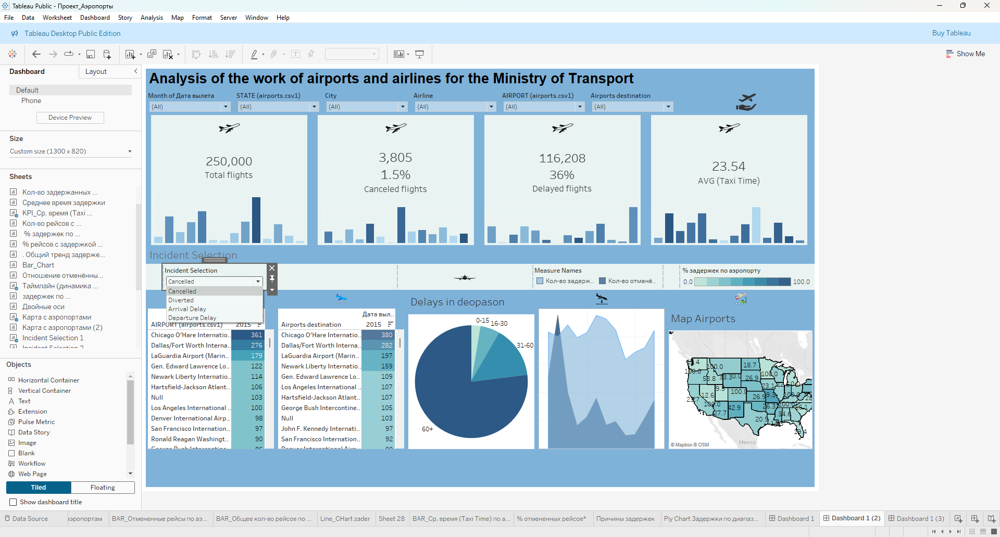

# Analyse der Arbeit von Flughäfen und Fluggesellschaften

Dieses Projekt ist ein interaktives **Dashboard**, das mit **Tableau Public** erstellt wurde.  
Es zeigt eine umfassende Analyse der Leistung von Flughäfen und Fluggesellschaften für das **Verkehrsministerium**.  

## Funktionen

- **Gesamtzahl der Flüge**: Übersicht über alle durchgeführten Flüge.  
- **Stornierte Flüge**: Anzahl und prozentualer Anteil stornierter Flüge.  
- **Verspätete Flüge**: Anzahl und prozentualer Anteil verspäteter Flüge.  
- **Durchschnittliche Rollzeit (Taxi Time)**: Analyse der durchschnittlichen Zeit, die Flugzeuge auf dem Rollfeld verbringen.  
- **Filtermöglichkeiten**: Nach Monat, Bundesstaat, Stadt, Fluggesellschaft, Abflug- und Zielflughafen.  
- **Interaktive Visualisierungen**: Balkendiagramme, Kreisdiagramme, Liniendiagramme und Karten zur geografischen Verteilung.  

## Visualisierungen

- **Balkendiagramme**: Darstellung von Fluganzahlen und Stornierungen.  
- **Kreisdiagramm**: Analyse von Verspätungen nach Zeitintervallen.  
- **Liniendiagramm**: Dynamik der Verspätungen.  
- **Kartenansicht**: Verteilung von Verspätungen und Flügen in den Bundesstaaten der USA.  

## Screenshot

## Technologien

- **Tableau Public**  
- **CSV-Datensatz (Flug- und Flughafeninformationen)**  

## Verwendung

1. Öffne die Projektdatei in **Tableau Public**.  
2. Verbinde den bereitgestellten Datensatz (`airports.csv`).  
3. Verwende die Filter, um Analysen nach Zeitraum, Standort oder Fluggesellschaft durchzuführen.  

## Lizenz

Dieses Projekt ist unter der **MIT-Lizenz** veröffentlicht.  
Siehe die Datei [LICENSE](./LICENSE) für weitere Details.  
